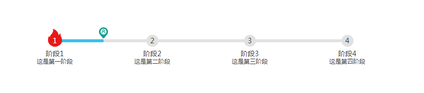

# steps #

## 介绍 ##

该插件是基于 [steps.js 2.0](https://github.com/fxss5201/steps) 版本改造的。

在 `src/index.html` 中有展示的demo。

## 效果展示 ##



## 浏览器支持情况 ##

<https://caniuse.com/#search=flex>，
由于布局中主要使用的是`flex`布局，所以支持IE10以上以及现代主流浏览器。
建议使用前先在你所要用的浏览器上查看demo。

## 资源 ##

首先需要引入样式文件steps.css：

```HTML
<link rel="stylesheet" href="steps.css">
```

接下来引入steps.js：

```HTML
<script src="steps.js"></script>
```

## 使用 ##

在使用的时候，需要一个容器，例如：

```HTML
<div id="steps1"></div>
```

然后在 JavaScript 中进行初始化：

```JavaScript
var steps1 = steps({
    el: "#steps1",
    data: [
        { title: "阶段1", description: "这是第一阶段" },
        { title: "阶段2", description: "这是第二阶段" },
        { title: "阶段3", description: "这是第三阶段" },
        { title: "阶段4", description: "这是第四阶段" }
    ],
    wrapperWidth: '800px', // 容器的宽度，默认是100%
    active: 0, // 当前激活项，从0开始
    position: 0, // 用户所处位置，也是从0开始
    dataOrder: ['line', 'title', 'description'], // 纵向数据显示的顺序
});
```